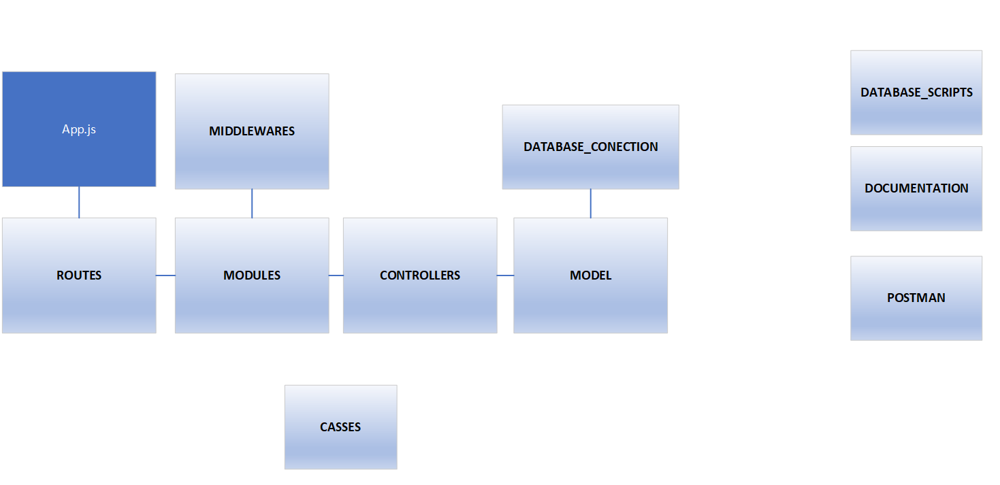

# **DELILAH RESTO Readme**
> API REST CRUD - Proyecto entregable 3 Acámica
## **1. Tecnologías aplicadas**


* [**NodeJS**](https://nodejs.org/es/)

* [**Librerías (npm)**](https://www.npmjs.com/)
Los paquetes Node Package Manager (NPM) necesarios para el presente proyecto, se encuentran detallados en el archivo [package.json](https://github.com/GustavoCarrena/delilah_resto/blob/main/package.json) .
* [**mariadb**](https://mariadb.org/documentation/)

## **2. Accesos**

* [**Acceso al repositorio de código**](https://github.com/GustavoCarrena/delilah_resto.git)

* [**Postman**](https://www.postman.com/)

    El archivo con los request para probar los endpoints del proyecto para importar en Postman se encuentra en [postman/delilah.postman_collection.json](https://github.com/GustavoCarrena/delilah_resto/blob/main/postman/delilah.postman_collection.json), y los parámetros requeridos para cada operación, se encuentran definidos en la documentación realizada con Swagger.

* [**Acceso la documentación del proyecto en Swagger**](https://github.com/GustavoCarrena/delilah_resto/blob/main/documentation/delilah_resto.yaml)

* [**Acceso al archivo db_create.sql con los scripts para creación de la Base de Dato y de tablas**](https://github.com/GustavoCarrena/delilah_resto/tree/main/database_scripts/scripts/scripts)

* [**Acceso al archivo db_inserts.sql con los scripts para inserción de datos básicos en las tablas**](https://github.com/GustavoCarrena/delilah_resto/blob/main/database_scripts/scripts/scripts/db_inserts.sql)


* [**Acceso al archivo con la información de los puertos, la base, el host y user se encuentran en el siguiente archivo con las variable de entorno**](https://github.com/GustavoCarrena/delilah_resto/blob/main/.env)

## **3. Arquitectura de software**  

>Modelo - Controlador

### **3.1. Gráfica**

### **3.2. Descripción**
|CARPETA    |CONTENIDO |DESCRIPCIÓN |
| ----------| --------  | --------|
| model         |modelos sequelize  | sentencias sql |
| controllers   |implementación de métodos | funciones que requiere cogigo de model e interactúa con la DB |
| modules       |definición de metodos http, invoca middlewares y funciones de ejecución de la carpeta controllers  | utilizar express.Router |
| routes        |concentra los metodos http planteados en modules  | establece primer parámeto del endpoint |
| classes       |objeto respuesta  | reutilizable |
| database_conection   |conexion con DB  | consume archivos carpeta model |
| [database_scripts](https://github.com/GustavoCarrena/delilah_resto/tree/main/database_scripts/scripts/scripts)   |sentencias sql  | sistema de gestión mysql creación DB, tablas e inserciones de registros|
| documentation   |formato json  | archivo necesario para [documentación por Swagger](http://localhost:3000/delilah_documentation/) |
| postman   |formato json  | archivo para importar en aplicación postman, que contiene endpoints |
| Raiz   |app.js  | ejecución del servidor |
## **4. Modelado y Gestión de base de datos**
> Se utilizó el modelo relacional
### **4.1. Diagrama de entidad relación**

### **4.2. Script SQL de creación de base de datos y tablas**
El [código](https://github.com/GustavoCarrena/delilah_resto/tree/main/database_scripts/scripts/scripts) se encuentra en el repositorio

```sql
CREATE DATABASE delilah_db;
USE delilah_db;

CREATE TABLE users (
  user_id INT(7) UNSIGNED NOT NULL AUTO_INCREMENT,
  email VARCHAR(50) NOT NULL,
  fullname VARCHAR(50) NOT NULL,
  phone VARCHAR(50) NOT NULL, 
  adress VARCHAR(50) NOT NULL,
  user_password VARCHAR(50) NOT NULL, 
  user_admin TINYINT(1) NOT NULL, 
  PRIMARY KEY (user_id)
)ENGINE=InnoDB DEFAULT CHARSET=latin1;

CREATE TABLE products (
  product_id SMALLINT (6) UNSIGNED NOT NULL AUTO_INCREMENT,
  product_name VARCHAR(50) NOT NULL,
  product_description VARCHAR (255),
  product_price INT(10) UNSIGNED NOT NULL,
  product_disponibilty TINYINT(1) NOT NULL, 
  PRIMARY KEY (product_id)
)ENGINE=InnoDB DEFAULT CHARSET=latin1;

CREATE TABLE payment_methods (
  payment_code TINYINT(2) UNSIGNED NOT NULL AUTO_INCREMENT,
  payment_description VARCHAR(20) NOT NULL,
  PRIMARY KEY (payment_code)
)ENGINE=InnoDB DEFAULT CHARSET=latin1;

CREATE TABLE order_status (
  order_status_code TINYINT(1) UNSIGNED NOT NULL AUTO_INCREMENT,
  order_status_description VARCHAR(20) NOT NULL, 
  PRIMARY KEY (order_status_code)
)ENGINE=InnoDB DEFAULT CHARSET=latin1;

  CREATE TABLE orders (
    user_id INT(7) UNSIGNED,
    order_id INT(10) UNSIGNED NOT NULL AUTO_INCREMENT,
    payment_code TINYINT(2) UNSIGNED,
    order_time TIMESTAMP,
    order_status_code TINYINT(1) UNSIGNED,
    order_adress VARCHAR (255) NOT NULL,
    total INT(10) UNSIGNED,
    FOREIGN KEY (user_id) REFERENCES users(user_id),
    FOREIGN KEY (order_status_code) REFERENCES order_status (order_status_code),
    FOREIGN KEY (payment_code) REFERENCES payment_methods(payment_code),
    PRIMARY KEY (order_id)
  )ENGINE=InnoDB DEFAULT CHARSET=latin1;

CREATE TABLE order_products (
  order_id INT(10) UNSIGNED,
  product_id SMALLINT(6) UNSIGNED,
  product_quantity TINYINT(3) UNSIGNED NOT NULL,
  FOREIGN KEY (order_id) REFERENCES orders (order_id),
  FOREIGN KEY (product_id) REFERENCES products (product_id),
  PRIMARY KEY (order_id, product_id)
)ENGINE=InnoDB DEFAULT CHARSET=latin1;
```
### **4.3. Script SQL de inserción de registros**
El [código](https://github.com/GustavoCarrena/delilah_resto/blob/main/database_scripts/scripts/scripts/db_inserts.sql) se encuentra en el repositorio con el fin de poder utilizar las funcionalidades del sistema

```sql
INSERT INTO products (product_name,product_description,product_price,product_disponibilty) VALUES
('Hamburguesa Simple','Hamburguesa con tomate, lechuga y papas fritas',500,1),
('Hamburguesa Completa','Hamburguesa con tomate, lechuga, huevo y papas fritas',700,1),
('Milanesa Completa','Milanesa con tomate, lechuga, huevo y papas fritas',600,1);

INSERT INTO payment_methods (payment_description) VALUES
('Pendiente'),
('Efectivo'),
('Tarjeta');

INSERT INTO order_status (order_status_description) VALUES
('Pendiente'),
('Cancelado'),
('Confirmado'),
('En Preparación'),
('En Camino'),
('Entregado');
 ```